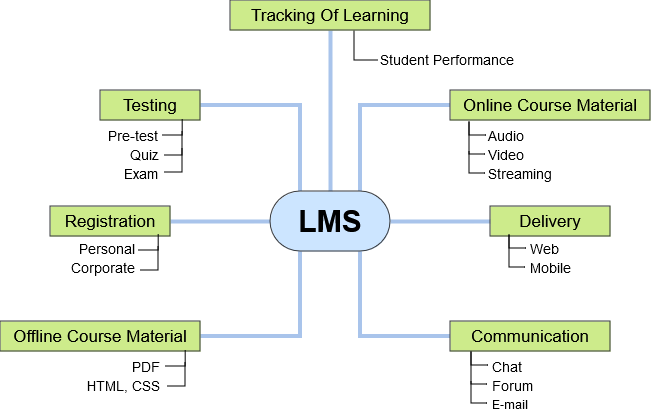
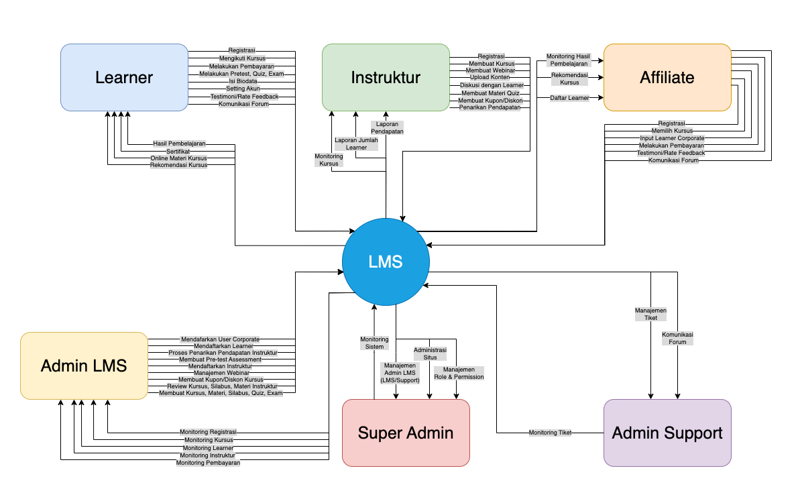
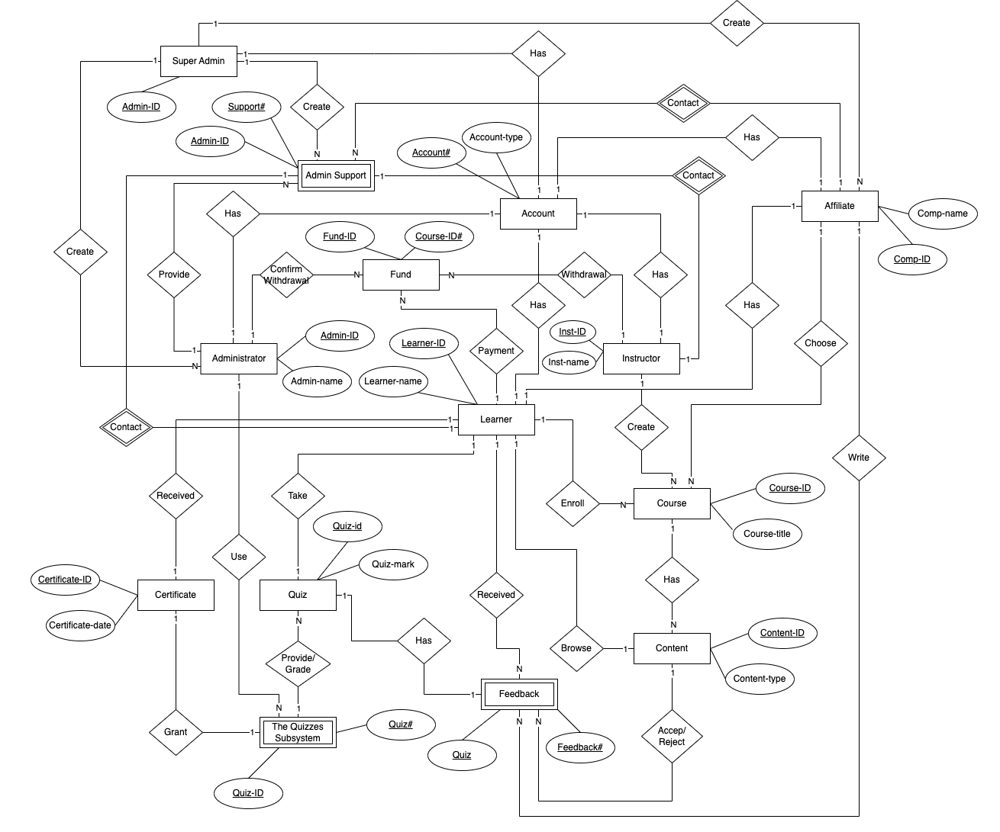
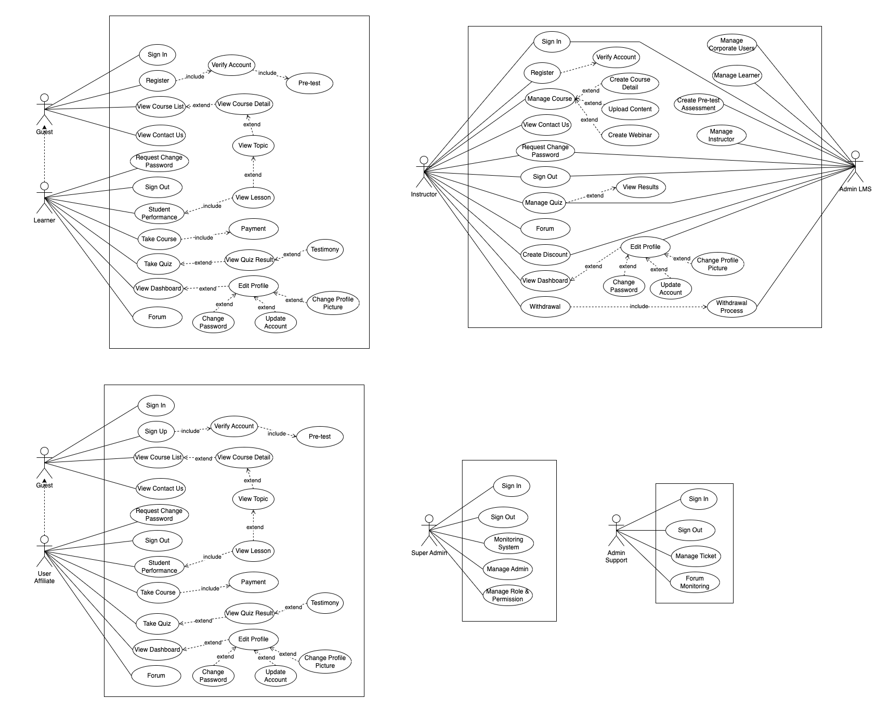

# DIAGRAMS
## Table of Contents
- [Feature Diagram](#feature-diagram)
- [Flow System](#flow-system)
- [Context Diagram](#context-diagram)
- [Entity Relationship Diagram](#entity-relationship-diagram)
- [Use Case Diagram](#use-case-diagram)
- [Class Diagram](#class-diagram)
 
 
 
## Feature Diagram
Feature diagrams depict the static feature of the elements in ECO-HUB system. 

Source : https://drive.google.com/file/d/1M8SA9DwxBtuvaTFZIuqRjMotKGjRlGhI/view?usp=sharing

## Flow System
show the interactions between a system and other actors (external factors) with which the system is designed to interface.

Source : https://drive.google.com/file/d/1PiyPupESJ6pq34TVbbA3c2rUG_SAsedQ/view?usp=sharing

## Context Diagram
show the interactions between a system and other actors (external factors) with which the system is designed to interface.

Source : https://drive.google.com/file/d/1nrcMF7g26hQsDE3-YKfEqjS0m-JP4L3E/view?usp=sharing

## Entity Relationship Diagram
An Entity Relationship (ER) Diagram is a type of flowchart that illustrates how “entities” such as people, objects or concepts relate to each other within a system.

Source : https://drive.google.com/file/d/1QKpAWB7bqoIODRm90yvjHXy7OZrZM7_M/view?usp=sharing

## Use Case Diagram
Use-case diagrams describe the high-level functions and scope of a system. These diagrams also identify the interactions between the system and its actors. The use cases and actors in use-case diagrams describe what the system does and how the actors use it, but not how the system operates internally.

Source : https://drive.google.com/file/d/1ESnmjI10sHDH_Ra8Lqgscc9x6iBgvA5u/view?usp=sharing

## Class Diagram
A class diagram is a type of Unified Modeling Language (UML) diagram that represents the structure of a system by showing its classes, attributes, operations (or methods), and the relationships among objects. It is commonly used in software engineering to model and design object-oriented systems.

Source : https://drive.google.com/file/d/1aZVbS8tzT1eG6dFIzjPtyGMpl2jMbtZ8/view?usp=sharing
